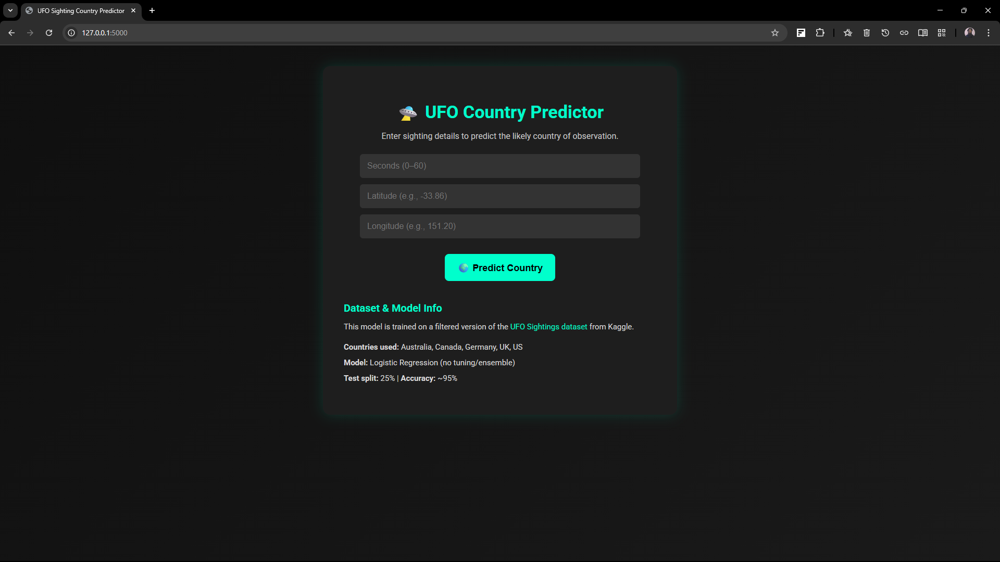

## 🚀 UFO Sighting Country Predictor 🌍

This project is a basic machine learning web application built using **Flask**, predicts the **country** where a **UFO sighting** might have been reported, based on the **duration (in seconds)**, **latitude**, and **longitude** of the sighting.

It demonstrates the complete **ML model deployment workflow** — from preprocessing and training a model to building an interactive web interface for predictions.

---

### 📊 Dataset

* Source: [UFO Sightings Dataset on Kaggle](https://www.kaggle.com/datasets/NUFORC/ufo-sightings)
* Filtered for five countries:
  **Australia**, **Canada**,**Germany**,**UK**,**US**

---

### 🧠 Model Information

* **Algorithm**: Logistic Regression (Scikit-learn)
* **Features used**: `duration (seconds)`, `latitude`, `longitude`
* **Target**: Country
* **Label Encoding**: Country names are encoded as integers for model training
* **Accuracy**: \~95% (with 25% test size)
* **Note**: No hyperparameter tuning or ensemble methods were applied — this project is meant for educational and workflow learning purposes.

---

### 💻 Tech Stack

* **Backend**: Python 3, Flask
* **Frontend**: HTML5, CSS3
* **ML Library**: Scikit-learn (Logistic)
* **Package Manager**: **uv**(ultra-fast Python package manager)
* **Version Control**: Git

---

### 📦 Installation

1. **Clone the repository**

   ```bash
   git clone https://github.com/Pritam-Stats/UFO-Sightings-WebApp.git
   cd ufo-Sightings-WebApp
   ```

2. **Initialize and install dependencies using `uv`**

   ```bash
   uv venv
   uv pip install -r requirements.txt
   ```

3. **Run the application**

   ```bash
   flask run
   ```
   or,
   ```bash
   uv run app.py
   ```
   or,
   ```bash
   python app.py
   ```

4. **Open in your browser**

   ```
   http://127.0.0.1:5000/
   ```

---

### 🌟 Screenshot



---

### Acknowledgment

This project is **not an original idea**, but rather an **educational exercise** to understand how to build and deploy machine learning models into Flask web applications.
I have taken **inspiration and help** from open-source tutorials, datasets, and guides available freely on the internet.

> Special thanks to the ML and Python communities and Microsoft for open educational content.

---

### 📁 Project Structure

```bash
ufo-country-predictor/
├── app.py
├── model.pkl
├── encoder.pkl
├── static/
│   └── css/
│       └── styles.css
├── templates/
│   └── index.html
├── requirements.txt
└── README.md
```
This project is intended for **learning purposes only**.